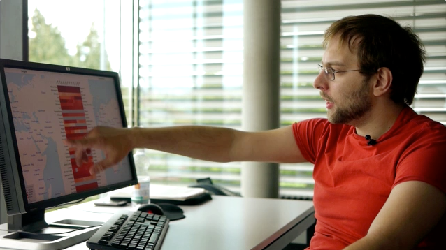

I am Pavel. Currently I am finishing my Master degree in one of the Technical Universities in Alpine region.
<a href="/">Here</a> you can find some of my projects, briefs from travels and, probably, something more  
I've worked at VFX company in Moscow, Data visualization bureau in Munich and at Swiss design studio in Lisbon office. Currently I am focusing on my Master Thesis which I suppose to write about <a href="https://en.wikipedia.org/wiki/Vehicle-to-everything" target="_blank" rel="noopener">V2X technologies for European cities</a>. 

My special interest is in visualizing data about 
geographic movement of people or goods, e.g. transport-related data. I also create simulation models using Java and AnyLogic. Some time I spend to dig into computer security topics.

My Bachelor Thesis I completed in TU Munich working on a project for BMW AG Forschungzentrum reconstruction.
I usually use Python, C++ and some Java. My attempts of Assembler programming are miserable but could be counted as well. Some Javascript also meets me last months while making data visualization projects.
 
You can find [some of my code online](https://github.com/FTi130). 

Work aside, I am a ski lover, and a member of <a href="https://www.akaflieg.vo.tum.de/de/" target="_blank" rel="noopener">Akaflieg München</a>.

Check out <a href="/resume/">my full resume</a> for more 
details on my professional background.

